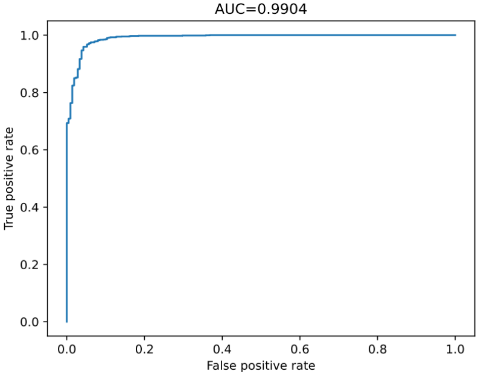
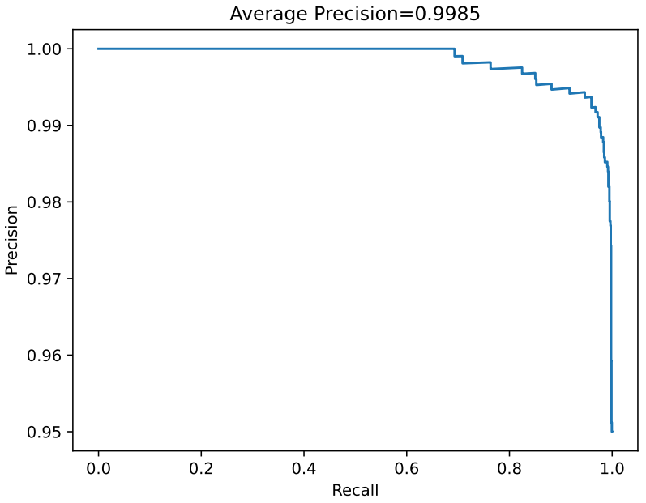
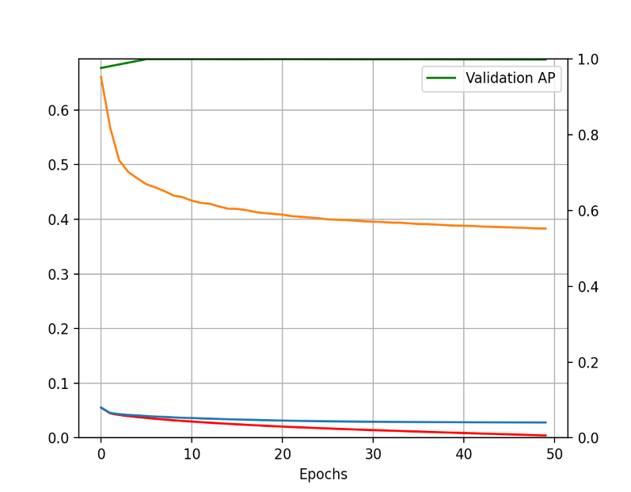
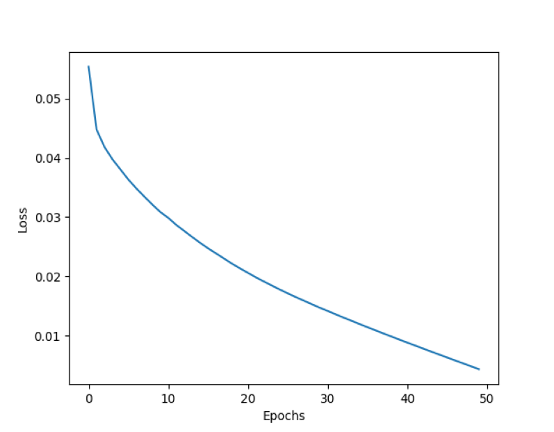
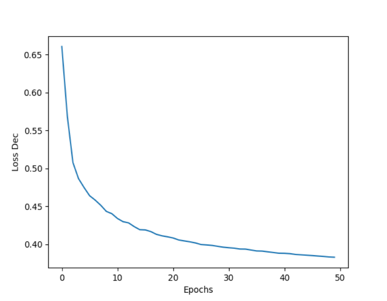
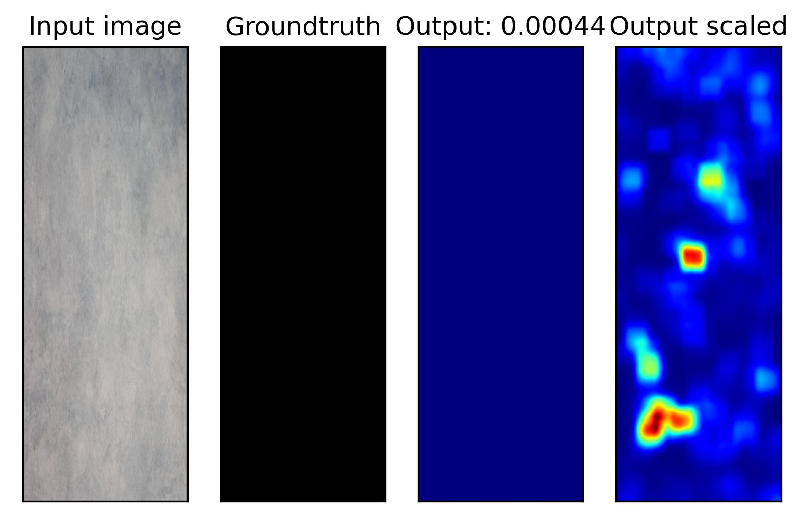
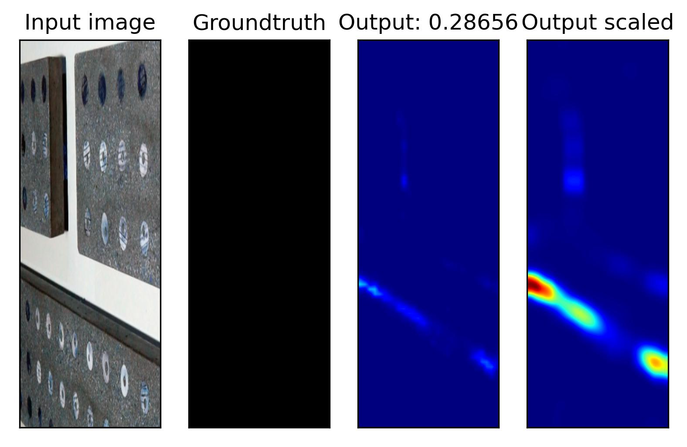
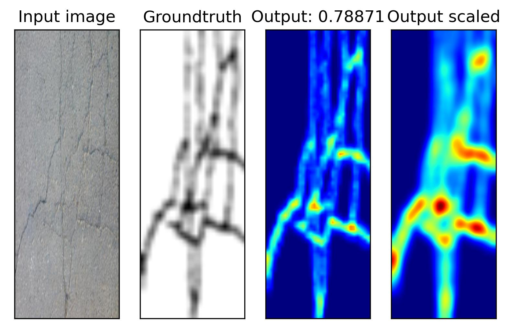
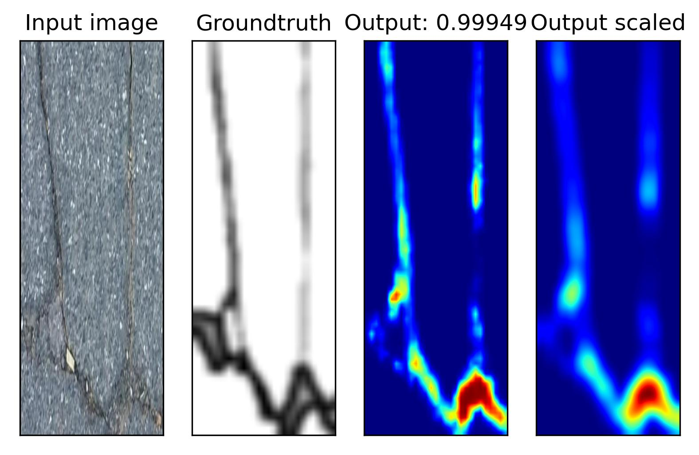

# Results of training on crack_segmentation dataset

## Dataset

| Parameter         | Value       |
| -----------       | ----------- |
| Input channels    | 3           |
| Input height      | 640         |
| Input width       | 232         |
| Input width       | 232         |
| Train samples     | 9603        |
| Test samples      | 1695        |
| Segmented samples | 9887        |

| Set         | Positives   | Negatives   |  Sum        |
| ----------- | ----------- | ----------- | ----------- |
| Train       | 8404        | 1199        | 9603        |
| Test        | 1483        | 212         | 1695        |
| **Sum**     | 9887        | 1411        | 11298       |

## Run parameters
| Parameter                      | Value       |
| -----------                    | ----------- |
| Batch size                     | 1           |
| Epochs                         | 50          |
| Learning rate                  | 1           |
| Delta CLS Loss                 | 0.01        |
| Dilate                         | 1           |
| Dynamically balanced loss      | True        |
| Frequency-of-use sampling      | True        |
| Gradien-flow adjustment        | True        |
| Weighted segmentation loss     | True        |
| Weighted segmentation loss Max | 1.0         |
| Weighted segmentation loss P   | 2.0         |
| Use best model                 | False       |

## Results

|                  | True        | False       |
| -----------      | ----------- | ----------- |
| **Positives**    | 1475        | 8           |
| **Negatives**    | 27          | 185         |

## Test outputs

Output of model learning is [here](./nohup.out).